# Agent Session Documentation

## Project Overview

This project converts Squarespace exports (WordPress XML format) into Markdown files and downloads associated images. It's designed to help migrate Squarespace content to platforms like Jekyll, Hugo, or Ghost.

### Source Website Information

- **Website Title**: SMA Professional Development Website
- **Website URL**: https://pd.mediaacademy.sg/
- **Sitemap URL**: https://pd.mediaacademy.sg/sitemap.xml

### Programmes

The website features the following main programmes:

- **Funded Programmes**
- **Funded Mentorship Support**
- **Corporate Training**
- **Masterclasses**

## Session Summary

### Date: December 31, 2025

### Actions Performed

1. **Studied the README.md and codebase**
   - Reviewed project structure and functionality
   - Identified code issues and inconsistencies
   - Understood the conversion workflow

2. **Installed Dependencies**
   - Ran `pip3 install -r requirements.txt`
   - Verified installation of:
     - beautifulsoup4 (4.13.4)
     - lxml (6.0.0)
     - soupsieve (dependency)
     - typing-extensions (dependency)

3. **Executed the Conversion Script**
   - Copied `xml/squarespace.xml` to root directory (script expects it there)
   - Ran: `python3 script.py --download_images`
   - Script executed successfully

4. **Created Image Mapping Tools**
   - Created `map_images_to_pages.py` to analyze which images belong to which pages
   - Generated JSON mapping files:
     - `image_mapping_pages_to_images.json` - Maps each page to its images
     - `image_mapping_images_to_pages.json` - Maps each image to pages that use it
   - Created `add_images_to_markdown.py` to add image references back to markdown files
   - Successfully added image references to 51 markdown files

### Execution Results

- **Images Found**: 175 image URLs detected in XML
- **Images Downloaded**: 173 images successfully downloaded
- **Images Failed**: 2 images failed with 404 errors (after 3 retry attempts each)
  - `SGUS-Desktop-Slider-2000x500-1.jpg?format=original`
  - `SGUS-Mobile-Slider-750x500-1.jpg?format=original`
- **Content Parsed**: 129 HTML items converted to Markdown
- **Output Generated**:
  - `img/` directory: Contains all downloaded images
  - `posts/` directory: Contains 129 markdown files with frontmatter

### Key Findings

#### Issues Identified

1. **Namespace Argument Not Used**
   - The `--namespace` CLI argument is parsed but never actually used
   - Namespace is hardcoded in functions (`get_image_urls`, `parse_html_contents`)
   - The `namespace` variable is created in `__main__` but never passed to functions

2. **Test Command Inconsistency**
   - README says: `python -m unittest test_script.py`
   - Should be: `python -m unittest test_script` (without `.py`) or `python test_script.py`

3. **Image URL Handling**
   - The `--img_url` expects a domain (e.g., `images.squarespace-cdn.com`)
   - Code automatically adds `https://` if missing
   - README could be clearer about this behavior

#### Code Quality Observations

- ✅ Good error handling with retry logic (3 attempts)
- ✅ Concurrent downloads using ThreadPoolExecutor (10 workers)
- ✅ Structured logging throughout
- ✅ Proper use of BeautifulSoup for HTML parsing
- ✅ Handles missing XML elements gracefully with defaults
- ✅ Creates proper directory structure for posts

### File Structure After Execution

```
squarespace-export-to-markdown/
├── AGENTS.md (this file)
├── LICENSE
├── README.md
├── requirements.txt
├── script.py
├── test_script.py
├── squarespace.xml (copied from xml/ directory)
├── img/ (173 downloaded images)
└── posts/ (129 markdown files)
    ├── home.md
    ├── corporate-training.md
    ├── ... (127 more files)
```

### Notes for Future Reference

1. **XML File Location**: The script expects `squarespace.xml` in the root directory. The original file is in `xml/squarespace.xml`, so it was copied to root before execution.

2. **Image Downloads**: The script uses concurrent downloads (10 workers) which makes it efficient. Failed downloads are logged but don't stop the process.

3. **Markdown Output**: Each markdown file includes:
   - Frontmatter with `title` and `date`
   - Content extracted from HTML (text only, HTML tags removed)

4. **Potential Improvements**:
   - Fix the `--namespace` argument to actually be used
   - Update README test command
   - Consider adding option to specify XML file path instead of hardcoding `squarespace.xml`
   - Consider preserving some HTML formatting in markdown (currently only extracts text)

### Next Steps (If Needed)

- Review generated markdown files for quality
- Manually fix any formatting issues
- Update image references in markdown if needed
- Import to target platform (Jekyll/Hugo/Ghost)

## Website Sitemap

The website structure is visualized as a class diagram showing all 129 pages organized hierarchically. Each page class includes:
- **url**: The page URL path
- **mdFile**: The corresponding markdown filename in the `posts/` directory
- **pages**: Page count for section pages

```mermaid
classDiagram
    class Root {
        +string title: "SMA Professional Development"
        +string domain: "pd.mediaacademy.sg"
        +int totalPages: 129
    }
    
    class Home {
        +string url: "/home"
        +string mdFile: "home.md"
        +int pages: 1
    }
    
    class FundedProgrammes {
        +string url: "/funded-programmes"
        +string mdFile: "funded-programmes.md"
        +int pages: 26
    }
    
    class CorporateTraining {
        +string url: "/corporate-training"
        +string mdFile: "corporate-training.md"
        +int pages: 4
    }
    
    class Masterclasses {
        +string url: "/masterclasses"
        +string mdFile: "masterclasses.md"
        +int pages: 1
    }
    
    class MentorshipSupport {
        +string url: "/mentorship-support-grant"
        +int pages: 1
    }
    
    class WorkshopsSeminars {
        +string url: "/workshops-seminars"
        +string mdFile: "workshops-seminars.md"
        +int pages: 6
    }
    
    class FormsEnquiries {
        +string url: "/funding-information"
        +string mdFile: "funding-information.md"
        +int pages: 12
    }
    
    class OtherPages {
        +int pages: 77
    }
    
    class WSQFramework {
        +int pages: 7
    }
    
    class SGUSProgramme {
        +int pages: 8
    }
    
    class SFMCourses {
        +int pages: 11
    }
    
    class BroadcastJournalism {
        +string url: "/broadcast-journalism"
        +string mdFile: "broadcast-journalism.md"
    }
    
    class CreativeWriting {
        +string url: "/creative-writing"
        +string mdFile: "creative-writing.md"
    }
    
    class BusinessManagement {
        +string url: "/business-management-media"
        +string mdFile: "business-management-media.md"
    }
    
    class FilmTVProduction {
        +string url: "/film-tv-images"
        +string mdFile: "film-tv-images.md"
    }
    
    class RadioSound {
        +string url: "/radio-sound"
        +string mdFile: "radio-sound.md"
    }
    
    class AdvertisingPublicAffairs {
        +string url: "/advertising-public-affairs"
        +string mdFile: "advertising-public-affairs.md"
    }
    
    class NewMediaTechnology {
        +string url: "/new-media-technology"
        +string mdFile: "new-media-technology.md"
    }
    
    class SGUSMain {
        +string url: "/sgus"
        +string mdFile: "sgus.md"
    }
    
    class SGUSMobileVideography {
        +string url: "/sgus-mw"
        +string mdFile: "sgus-mw.md"
    }
    
    class SGUSOnlineMarketing {
        +string url: "/sgus-omcc"
        +string mdFile: "sgus-omcc.md"
    }
    
    class SGUSSocialVideoEditing {
        +string url: "/sgus-sve"
        +string mdFile: "sgus-sve.md"
    }
    
    class SFMEssentialMediaSkills {
        +string url: "/sms/sfm-ems"
        +string mdFile: "sfm-ems.md"
    }
    
    class SFMMobileVideography101 {
        +string url: "/sms/sfm-mv101"
        +string mdFile: "sfm-mv101.md"
    }
    
    class SFMMediaIndustryEntry {
        +string url: "/sms/sfm-mies"
        +string mdFile: "sfm-mies.md"
    }
    
    class SFM10NoNosSocialMedia {
        +string url: "/sms/sfm22-emsps"
        +string mdFile: "sfm22-emsps.md"
    }
    
    class CorporateTrainingMain {
        +string url: "/corporate-training"
        +string mdFile: "corporate-training.md"
    }
    
    class CorporateTrainingSolutions {
        +string url: "/corporate-training-1"
        +string mdFile: "corporate-training-1.md"
    }
    
    class CameraPresence {
        +string url: "/corporate-training-courses/cpbl"
        +string mdFile: "cpbl.md"
    }
    
    class MediaSpokesmanship {
        +string url: "/corporate-training-courses/mst"
        +string mdFile: "mst.md"
    }
    
    class AceJobInterview {
        +string url: "/wks/atji"
        +string mdFile: "atji.md"
    }
    
    class CorporateChicMakeup {
        +string url: "/wks/ccm"
        +string mdFile: "ccm.md"
    }
    
    class DressToImpress {
        +string url: "/wks/dress2impress"
        +string mdFile: "dress2impress.md"
    }
    
    class HolidayVideo {
        +string url: "/wks/phvm"
        +string mdFile: "phvm.md"
    }
    
    class FundingInformation {
        +string url: "/funding-information"
        +string mdFile: "funding-information.md"
    }
    
    class CorporateEnquiry {
        +string url: "/ct-form"
        +string mdFile: "ct-form.md"
    }
    
    class CourseEnquiryForms {
        +string url: "/smeocm-form"
        +string mdFile: "smeocm-form.md"
    }
    
    Root --> Home
    Root --> FundedProgrammes
    Root --> CorporateTraining
    Root --> Masterclasses
    Root --> MentorshipSupport
    Root --> WorkshopsSeminars
    Root --> FormsEnquiries
    Root --> OtherPages
    
    FundedProgrammes --> WSQFramework
    FundedProgrammes --> SGUSProgramme
    FundedProgrammes --> SFMCourses
    
    WSQFramework --> BroadcastJournalism
    WSQFramework --> CreativeWriting
    WSQFramework --> BusinessManagement
    WSQFramework --> FilmTVProduction
    WSQFramework --> RadioSound
    WSQFramework --> AdvertisingPublicAffairs
    WSQFramework --> NewMediaTechnology
    
    SGUSProgramme --> SGUSMain
    SGUSProgramme --> SGUSMobileVideography
    SGUSProgramme --> SGUSOnlineMarketing
    SGUSProgramme --> SGUSSocialVideoEditing
    
    SFMCourses --> SFMEssentialMediaSkills
    SFMCourses --> SFMMobileVideography101
    SFMCourses --> SFMMediaIndustryEntry
    SFMCourses --> SFM10NoNosSocialMedia
    
    CorporateTraining --> CorporateTrainingMain
    CorporateTraining --> CorporateTrainingSolutions
    CorporateTraining --> CameraPresence
    CorporateTraining --> MediaSpokesmanship
    
    WorkshopsSeminars --> AceJobInterview
    WorkshopsSeminars --> CorporateChicMakeup
    WorkshopsSeminars --> DressToImpress
    WorkshopsSeminars --> HolidayVideo
    
    FormsEnquiries --> FundingInformation
    FormsEnquiries --> CorporateEnquiry
    FormsEnquiries --> CourseEnquiryForms
```



### Sitemap Structure Summary

- **Total Pages**: 129 pages
- **Main Sections**: 8 primary navigation sections
  - Home (1 page)
  - Funded Programmes (26 pages) - includes WSQ, SGUS, and SFM courses
  - Corporate Training (4 pages)
  - Masterclasses (1 page)
  - Funded Mentorship Support (1 page)
  - Workshops & Seminars (6 pages)
  - Forms & Enquiries (12 pages)
  - Other Content Pages (77 pages)

### Pages Not Shown in Diagram

The following **99 pages** are not explicitly shown in the diagram above but are part of the website. This list ensures no pages are lost during migration.

> **Complete List**: See `pages_not_in_diagram.md` for a comprehensive table of all 99 pages with their URLs and markdown filenames.

#### SGUS Pages (4 pages)

- **SGUS - Media Writing Certificate Programme**
  - URL: `/sgunited-courses/sgus-mw`
  - MD File: `sgus-mw.md`

- **SGUS - Media Writing Certificate Programme (Copy)**
  - URL: `/sgus-mw-1`
  - MD File: `sgus-mw-1.md`

- **SGUS - Online Marketing and Content Creation Certificate Programme (Copy)**
  - URL: `/sgus-omcc-1`
  - MD File: `sgus-omcc-1.md`

- **Train to Thrive: Funding Your Training - SGUnited Jobs and Skills Package**
  - URL: `/sms/t-t-sgus`
  - MD File: `t-t-sgus.md`

#### SFM Pages (1 page)

- **Mobile Videography 101**
  - URL: `/sms/sfm22-mv101`
  - MD File: `sfm22-mv101.md`

#### Corporate Training (1 page)

- **Storytelling Online & Offline**
  - URL: `/corporate-training-courses/stoo`
  - MD File: `stoo.md`

#### Workshops (4 pages)

- **Nurturing Brand Champions**
  - URL: `/wks/nbc`
  - MD File: `nbc.md`

- **Storytelling – Making Content Meaningful**
  - URL: `/wks/sfm22-smcm`
  - MD File: `sfm22-smcm.md`

- **Your Future in the Media Industry**
  - URL: `/wks/sfm22-yfmi`
  - MD File: `sfm22-yfmi.md`

- **Sustainable Integrated Engagement in the Age of Consent**
  - URL: `/wks/sieac`
  - MD File: `sieac.md`

#### Forms (9 pages)

- **Brand Management Enquiry**
  - URL: `/bm-form`
  - MD File: `bm-form.md`

- **Branding Through Videography and Photography Enquiry**
  - URL: `/btvp-form`
  - MD File: `btvp-form.md`

- **Content Marketing Strategy Enquiry**
  - URL: `/cms-form`
  - MD File: `cms-form.md`

- **Creative Storytelling - Developing Storylines Enquiry**
  - URL: `/csds-form`
  - MD File: `csds-form.md`

- **Digital Marketing Enquiry**
  - URL: `/dm-form`
  - MD File: `dm-form.md`

- **Developing the Pilot Episode Enquiry**
  - URL: `/dpe-form`
  - MD File: `dpe-form.md`

- **Effective Presentations and Pitches in a Virtual Environment Enquiry**
  - URL: `/eppve-form`
  - MD File: `eppve-form.md`

- **Form Template**
  - URL: `/form-template`
  - MD File: `form-template.md`

- **Form Template (Message)**
  - URL: `/form-template-msg`
  - MD File: `form-template-msg.md`

#### Other Pages (80 pages)

**WSQ Course Pages:**
- Various WSQ course detail pages under `/bsm/`, `/ctw/`, `/ftv/`, `/rsd/`, `/nmt/` paths

**SFM Course Pages:**
- `/sms/10nnsmm` → `10nnsmm.md` - 10 No-Nos in Social Media Marketing
- `/sms/bts` → `bts.md` - Behind the Scenes: A Virtual Media Micro-Learning Series
- `/sms/ciut` → `ciut.md` - Communications in Uncertain Times
- `/sms/createwebseries` → `createwebseries.md` - Creating a Web Series

**SkillsFuture for Digital Workplace:**
- `/sfdw-courses/dm101` → `dm101.md` - SFDW Digital Marketing 101
- `/sfdw-courses/dmpv` → `dmpv.md` - SFDW Digital Marketing Using Photos and Videos
- `/sfdw-courses/fpdw` → `fpdw.md` - SFDW Fundamentals of a Professional in a Digital Workplace
- `/sfdw-courses/gho` → `gho.md` - SFDW Getting Headhunted Online
- `/skillsfuture-for-digital-workplace` → `skillsfuture-for-digital-workplace.md`
- `/old-skillsfuture-for-digital-workplace` → `old-skillsfuture-for-digital-workplace.md`

**Masterclasses:**
- `/mcs/ddcd` → `ddcd.md` - Data-Driven Content Development Workshop
- `/mcs/dpe` → `dpe.md` - Developing the Pilot Episode
- `/mcs/dscmp` → `dscmp.md` - Developing Stories for Cross Media Projects

**About/Info Pages:**
- `/aitp` → `aitp.md` - Accelerated Industry-centric Training Pathway
- `/apa/smprecm` → `smprecm.md` - Social Media - Public Relations, Ethics and Crisis Management
- `/board-of-directors` → `board-of-directors.md`
- `/campus-facilities` → `campus-facilities.md`
- `/edutrust-certification` → `edutrust-certification.md`
- `/enquire-now` → `enquire-now.md`
- `/faq` → `faq.md`
- `/organisation-chart` → `organisation-chart.md`
- `/vision-mission-values` → `vision-mission-values.md`

**Homepage Variants:**
- `/home-202111` → `home-202111.md`
- `/home-copy-1` → `home-copy-1.md`
- `/homepage-desktop-slider` → `homepage-desktop-slider.md`
- `/homepage-mobile-slider` → `homepage-mobile-slider.md`
- `/funded-programmes-1` → `funded-programmes-1.md`

**Other:**
- `/msg-info` → `msg-info.md` - Information
- `/new-gallery-1` → `new-gallery-1.md`
- `/new-page-kr` → `new-page-kr.md`

**Note:** Many WSQ course pages follow patterns like `/bsm/*`, `/ctw/*`, `/ftv/*`, `/rsd/*`, `/nmt/*` and have corresponding markdown files with abbreviated names (e.g., `/bsm/bm` → `bm.md`). All 129 pages have been converted to markdown files in the `posts/` directory.

