# New Information Architecture (IA)

```mermaid
flowchart TD
  Home[Home]
  Programmes[Programmes]
  Corporate[Corporate Training]
  Masterclasses[Masterclasses]
  Workshops[Workshops & Seminars]
  About[About SMA]
  Contact[Contact & Enquiries]
  Resources[Resources]

  Programmes --> FundedOverview[Funded Programmes Overview]
  Programmes --> WSQ[WSQ Programmes]
  Programmes --> SGUS[SGUS Programmes]
  Programmes --> SFM[SFM Programmes]
  Programmes --> SFDW[SkillsFuture for Digital Workplace]
  Programmes --> Mentorship[Mentorship Support]

  Corporate --> CorpOverview[Corporate Training Overview]
  Corporate --> CorpSolutions[Solutions]
  Corporate --> CorpCourses[Corporate Training Courses]

  Masterclasses --> MasterOverview[Masterclasses Overview]
  Masterclasses --> MasterCatalogue[Masterclasses Catalogue]

  Workshops --> WorkshopOverview[Workshops Overview]
  Workshops --> WorkshopCatalogue[Workshops Catalogue]

  About --> Vision[Vision & Values]
  About --> Leadership[Leadership]
  About --> Accreditation[Accreditation]
  About --> Campus[Campus]
  About --> FAQ[FAQ]
  About --> AITP[Accelerated Industry-centric Training Pathway]

  Contact --> Funding[Funding Information]
  Contact --> CorporateEnquiry[Corporate Enquiry]
  Contact --> CourseEnquiry[Course Enquiry]
  Contact --> GeneralEnquiry[General Enquiry]
  Contact --> Templates[Form Templates]

  Resources --> Updates[News & Updates]
  Resources --> Archive[Archive]
```

## Page Inventory (posts_new_ia)

The following list mirrors every markdown page generated in `posts_new_ia/` to confirm that no pages were dropped during the IA migration.

- 10nnsmm.md
- advertising-public-affairs.md
- aitp.md
- atji.md
- bm-form.md
- bm.md
- board-of-directors.md
- broadcast-journalism.md
- bts.md
- btvp-form.md
- business-management-media.md
- campus-facilities.md
- cc.md
- ccm.md
- cg.md
- ciut.md
- cms-crsel.md
- cms-form.md
- co.md
- corporate-training-1.md
- corporate-training.md
- cpbl.md
- createwebseries.md
- creative-storytelling-director.md
- creative-writing.md
- crew-selection-director.md
- cs-sw.md
- cs.md
- csds-form.md
- csds.md
- ct-form.md
- d-ad.md
- d-sw.md
- ddcd.md
- direction-director.md
- dm-form.md
- dm.md
- dm101.md
- dmpv.md
- dmspdmp.md
- dpe-form.md
- dpe.md
- dress2impress.md
- dscmp.md
- ecpppsfb.md
- edutrust-certification.md
- enquire-now.md
- eppve-form.md
- eppve.md
- faq.md
- film-tv-images.md
- form-template-msg.md
- form-template.md
- fpdw.md
- funded-programmes-1.md
- funded-programmes.md
- funding-information.md
- gho.md
- home-202111.md
- home-copy-1.md
- home.md
- homepage-desktop-slider.md
- homepage-mobile-slider.md
- ive.md
- ls.md
- masterclasses.md
- mffc-se.md
- mffc-ve.md
- mipsl.md
- moc.md
- mpspp.md
- msg-info.md
- msncdmpc.md
- mst.md
- nbc.md
- nd.md
- new-gallery-1.md
- new-media-technology.md
- new-page-kr.md
- old-skillsfuture-for-digital-workplace.md
- organisation-chart.md
- pbm.md
- phvm.md
- pm.md
- poad.md
- pove.md
- ppbsmd.md
- pppp.md
- pps-ad.md
- pps-sw.md
- ppssm.md
- radio-sound.md
- sb.md
- sdc.md
- sel3.md
- sel4.md
- sfm-ems.md
- sfm-mies.md
- sfm-mv101.md
- sfm22-emsps.md
- sfm22-mv101.md
- sfm22-smcm.md
- sfm22-yfmi.md
- sgus-mw-1.md
- sgus-mw.md
- sgus-omcc-1.md
- sgus-omcc.md
- sgus-sve.md
- sgus.md
- sieac.md
- skillsfuture-for-digital-workplace.md
- sm.md
- smeocm-form.md
- smmma.md
- smprecm.md
- sro.md
- stoo.md
- sw.md
- t-t-sgus.md
- talent-casting.md
- ve.md
- vel3.md
- vel4.md
- vision-mission-values.md
- vsd.md
- wecimp.md
- workshops-seminars.md
