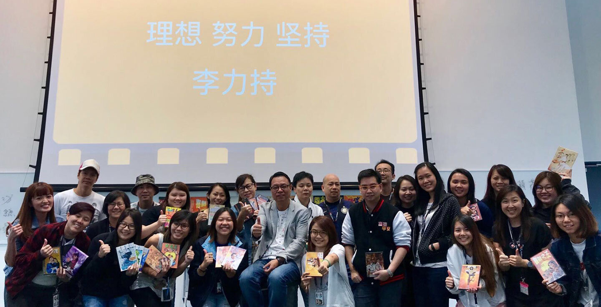
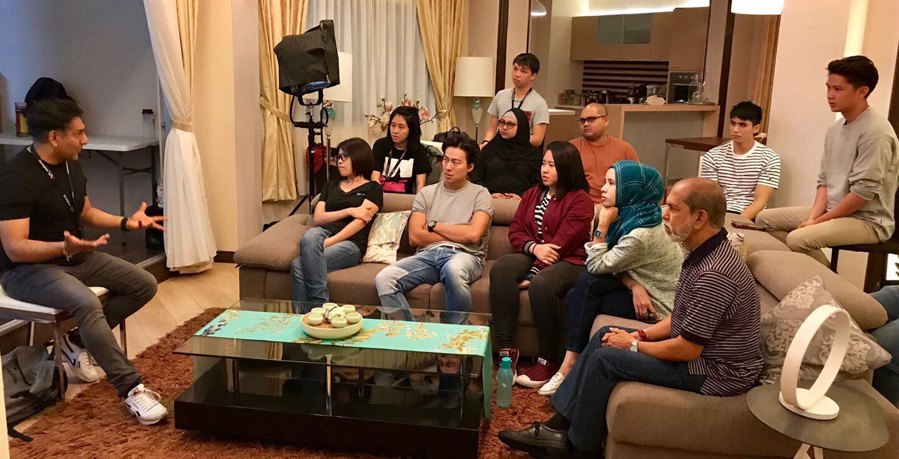
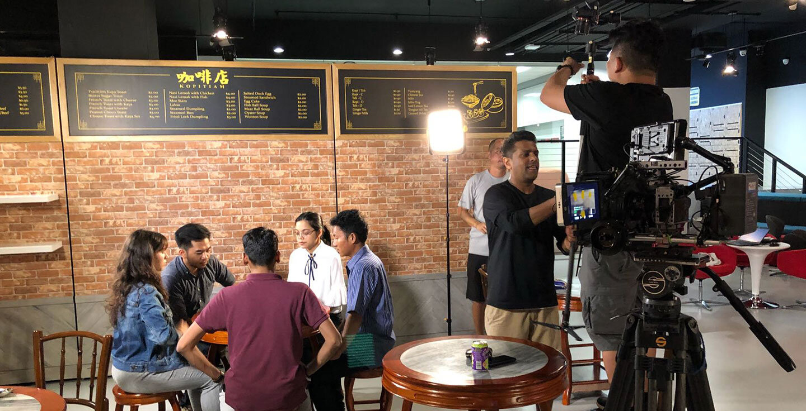

Funded Programmes
Masterclasses
Workshops & Seminars
Corporate Training
About Singapore Media Academy

Read more
In 2008, SMA was appointed by SkillsFuture Singapore (previously known as Workforce Development Agency) as the sole Continuing Education and Training Centre for the Singapore Media Industry and plays a central role in training and up-skilling media practitioners. SMA currently provides enrichment, education, and performance arts training to kids, youths, and hobbyists to nurture their creative and artistic potentials; training in film, broadcast, media and digital for adult professionals; and media training solutions and consultancy services to corporations and organisations.

SMA is awarded 4-year EduTrust Certification by the Committee for Private Education. EduTrust is a quality assurance scheme that recognises private education institutions for consistently maintaining high educational standards and services.

Mediacorp is Singapore’s largest content creator and national media network, operating a suite of TV channels, radio stations, and multiple digital platforms. Its mission is to engage, entertain, and enrich audiences by harnessing the power of creativity.

Mediacorp pioneered the development of Singapore’s broadcasting industry, with radio broadcast in 1936 and television broadcast in 1963. Today, it reaches 98% of Singaporeans in four languages and has a growing Asian audience base through CNA as well as entertainment content that is distributed across markets in the region.

Mediacorp is the recipient of industry accolades, including New York Festivals, World Media Festivals, PromaxBDA (World and Asia), and Asian Academy Creative Awards.

Media Gallery

## Images

