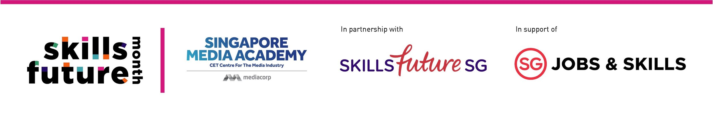

OverviewLearn how to shoot and edit content on your tablet or mobile phone! Understand basic settings, compositions, tips, gears, and recommended filming and editing software.Essential tips on Cinematography, sound, and lighting for mobile videographyIntroduction to equipment for mobile content creationIntroduction to free software for mobile video editingDemonstrationDuration1.5 HoursDate16 July 2021Time10:00amSpeakerRay Pang, Filmmaker

## Images

