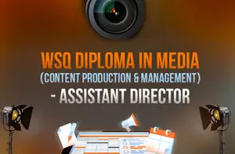
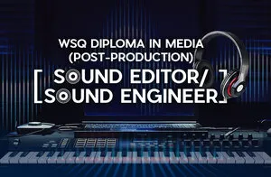
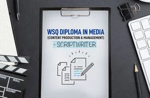
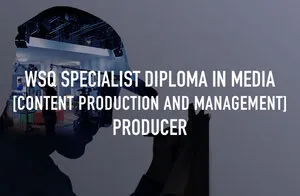

OverviewProfessionals who are armed with media skills have a competitive edge. Understand these skills and how you can stand out from your competition. Discover how digital disruption has redefined media professionals. Learn how to leverage the media skill set and digital media to promote your brand and grow your business.Duration1.5 HoursDateWednesday 20 July 2022Time7:00pm to 8:30pmSpeakerTimothy Tan graduated from the National University of Singapore majoring in Political Science and Chinese Studies. His career started in Television Corporation of Singapore (now known as Mediacorp) as an Assistant Director and then Casting Director. He has worked on casting for Hollywood films like ‘Rush Hour 2’ and ‘Legend of the Monkey King’  (Hallmark Entertainment) as well as regional co-productions like ‘AD2000’.Timothy was with National University of Singapore before he joined the renowned film school Tisch School of Arts’ branch campus. He is currently the Head of Singapore Media Academy - a media continuing education and training centre for the creative industries.

WSQ Diploma in Media Programmes

## Images

