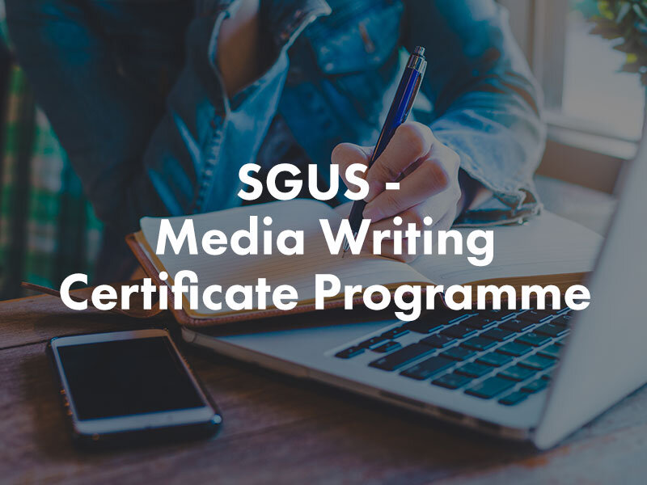

# SGUnited Skills Programme

The SGUS Programme offered by Singapore Media Academy is designed to provide Singapore Citizens and Permanent Residents with training to boost their employability and competitive edge. These funded full-time training courses range in 3 different disciplines - Media Writing, Sound & Video Editing, and Online Marketing & Content Creation. The courses are eligible for Singapore Citizens and Permanent Residents aged 21 and above. Participants must be able to commit to the training programme on a full-time basis. Successful applicant will receive a training allowance of S$1,200.00 per month, throughout the course of study. The course fees are highly subsidised, with a full nett fee of S$500 for each course, and the nett course fees are SkillsFuture Credits eligible. All courses are full-time programmes of duration 6 months each, comprising blended learning - virtual classes and face-2-face training. The courses are delivered by Industry Professionals. For
## More Information
on the SGUS Programme, the Eligibility Requirements and the Frequently Asked Questions, click here.

#### Images

